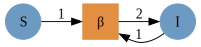

Simon Frost (@sdwfrost), 2023-06-13

## Introduction

This example serves as a 'Hello World' to composing Petri net models,
where models are 'glued' together using the shared states of the
individual submodels.

## Libraries

::: {.cell execution_count="1"}
``` {.julia .cell-code}
using AlgebraicPetri,AlgebraicPetri.TypedPetri
using Catlab, Catlab.CategoricalAlgebra, Catlab.Programs
using Catlab.WiringDiagrams
using AlgebraicDynamics.UWDDynam
using LabelledArrays
using OrdinaryDiffEq
using Plots
```
:::

## Transitions

We first define a labelled Petri net that has the different types of
transition in our models. The first argument is an array of state names
as symbols (here, a generic `:Pop`), followed by the transitions in the
model. Transitions are given as
`transition_name=>((input_states)=>(output_states))`.

::: {.cell execution_count="2"}
``` {.julia .cell-code}
epi_lpn = LabelledPetriNet(
  [:Pop],
  :infection=>((:Pop, :Pop)=>(:Pop, :Pop)),
  :recovery=>(:Pop=>:Pop)
);
```
:::

Labelled Petri nets contain four types of fields; `S`, states or
species; `T`, transitions; `I`, inputs; and `O`, outputs.

Next, we define the transmission model (from susceptibles, `S` to
infecteds, `I`) as an undirected wiring diagram using the `@relation`
macro, referring to the transitions in our labelled Petri net above
(`infection`). We include a reference to `Pop` in the definition of the
state variables to allow us to do this.

::: {.cell execution_count="3"}
``` {.julia .cell-code}
si_uwd = @relation (S, I) where (S::Pop, I::Pop) begin
    infection(S, I, I, I)
end;
```
:::

We then use `oapply_typed`, which takes in a labelled Petri net (here,
`epi_lpn`) and an undirected wiring diagram (`si_uwd`), where each of
the boxes is labeled by a symbol that matches the label of a transition
in the Petri net, in addition to an array of symbols for each of the
rates in the wiring diagram. This produces a Petri net given by
colimiting the transitions together, and returns the
`ACSetTransformation` from that Petri net to the type system.

::: {.cell execution_count="4"}
``` {.julia .cell-code}
si_acst = oapply_typed(epi_lpn, si_uwd, [:β]);
```
:::

To obtain the labelled Petri net, we extract the domain of the
`ACSetTransformation` using `dom`.

::: {.cell execution_count="5"}
``` {.julia .cell-code}
si_lpn = dom(si_acst);
```
:::

We can obtain a GraphViz representation of the labelled Petri net using
`Graph`.

::: {.cell execution_count="6"}
``` {.julia .cell-code}
Graph(si_lpn)
```

::: {.cell-output .cell-output-display execution_count="8"}

:::
:::

We repeat for the recovery (`I` to `R`) transition.

::: {.cell execution_count="7"}
``` {.julia .cell-code}
ir_uwd = @relation (I, R) where (I::Pop, R::Pop) begin
    recovery(I, R)
end
ir_acst = oapply_typed(epi_lpn, ir_uwd, [:γ])
ir_lpn = dom(ir_acst)
Graph(ir_lpn)
```

::: {.cell-output .cell-output-display execution_count="9"}

:::
:::

To glue the SI and IR models together to make an SIR model, we first
define an undirected wiring diagram which contains all our states, and
two transitions.

::: {.cell execution_count="8"}
``` {.julia .cell-code}
sir_uwd = @relation (S, I, R) where (S::Pop, I::Pop, R::Pop) begin
    si(S, I)
    ir(I, R)
end;
```
:::

We then create a `StructuredMulticospan` using this wiring diagram,
telling `oapply` that `si` in the wiring diagram corresponds to the
`si_lpn` labelled Petri net, etc.. `Open` converts a PetriNet to an
OpenPetriNet where each state is exposed as a leg of the cospan,
allowing it to be composed over an undirected wiring diagram.

::: {.cell execution_count="9"}
``` {.julia .cell-code}
sir_smc = oapply(sir_uwd, Dict(
    :si => Open(si_lpn),
    :ir => Open(ir_lpn),
))
```

::: {.cell-output .cell-output-display execution_count="11"}
    StructuredMulticospan{Catlab.CategoricalAlgebra.StructuredCospans.DiscreteACSet{AnonACSet{TypeLevelBasicSchema{Symbol, Tuple{:S}, Tuple{}, Tuple{:Name}, Tuple{(:sname, :S, :Name)}}, Tuple{Symbol}, Catlab.LVectors.LVector{(:S,), Int64}, NamedTuple{(:sname,), Tuple{Catlab.ColumnImplementations.DenseColumn{Symbol, Vector{Symbol}}}}}, LabelledPetriNet}, Multicospan{LabelledPetriNet, StructTightACSetTransformation{TypeLevelBasicSchema{Symbol, Tuple{:T, :S, :I, :O}, Tuple{(:it, :I, :T), (:is, :I, :S), (:ot, :O, :T), (:os, :O, :S)}, Tuple{:Name}, Tuple{(:tname, :T, :Name), (:sname, :S, :Name)}}, NamedTuple{(:T, :S, :I, :O), NTuple{4, Catlab.CategoricalAlgebra.FinSets.FinDomFunctionVector{Int64, Vector{Int64}, Catlab.CategoricalAlgebra.FinSets.FinSetInt}}}, LabelledPetriNet, LabelledPetriNet}, Vector{StructTightACSetTransformation{TypeLevelBasicSchema{Symbol, Tuple{:T, :S, :I, :O}, Tuple{(:it, :I, :T), (:is, :I, :S), (:ot, :O, :T), (:os, :O, :S)}, Tuple{:Name}, Tuple{(:tname, :T, :Name), (:sname, :S, :Name)}}, NamedTuple{(:T, :S, :I, :O), NTuple{4, Catlab.CategoricalAlgebra.FinSets.FinDomFunctionVector{Int64, Vector{Int64}, Catlab.CategoricalAlgebra.FinSets.FinSetInt}}}, LabelledPetriNet, LabelledPetriNet}}}, Vector{AnonACSet{TypeLevelBasicSchema{Symbol, Tuple{:S}, Tuple{}, Tuple{:Name}, Tuple{(:sname, :S, :Name)}}, Tuple{Symbol}, Catlab.LVectors.LVector{(:S,), Int64}, NamedTuple{(:sname,), Tuple{Catlab.ColumnImplementations.DenseColumn{Symbol, Vector{Symbol}}}}}}}(Multicospan{LabelledPetriNet, StructTightACSetTransformation{TypeLevelBasicSchema{Symbol, Tuple{:T, :S, :I, :O}, Tuple{(:it, :I, :T), (:is, :I, :S), (:ot, :O, :T), (:os, :O, :S)}, Tuple{:Name}, Tuple{(:tname, :T, :Name), (:sname, :S, :Name)}}, NamedTuple{(:T, :S, :I, :O), NTuple{4, Catlab.CategoricalAlgebra.FinSets.FinDomFunctionVector{Int64, Vector{Int64}, Catlab.CategoricalAlgebra.FinSets.FinSetInt}}}, LabelledPetriNet, LabelledPetriNet}, Vector{StructTightACSetTransformation{TypeLevelBasicSchema{Symbol, Tuple{:T, :S, :I, :O}, Tuple{(:it, :I, :T), (:is, :I, :S), (:ot, :O, :T), (:os, :O, :S)}, Tuple{:Name}, Tuple{(:tname, :T, :Name), (:sname, :S, :Name)}}, NamedTuple{(:T, :S, :I, :O), NTuple{4, Catlab.CategoricalAlgebra.FinSets.FinDomFunctionVector{Int64, Vector{Int64}, Catlab.CategoricalAlgebra.FinSets.FinSetInt}}}, LabelledPetriNet, LabelledPetriNet}}}(LabelledPetriNet:
      T = 1:2
      S = 1:3
      I = 1:3
      O = 1:3
      it : I → T = [1, 1, 2]
      is : I → S = [1, 2, 2]
      ot : O → T = [1, 1, 2]
      os : O → S = [2, 2, 3]
      tname : T → Name = [:β, :γ]
      sname : S → Name = [:S, :I, :R], StructTightACSetTransformation{TypeLevelBasicSchema{Symbol, Tuple{:T, :S, :I, :O}, Tuple{(:it, :I, :T), (:is, :I, :S), (:ot, :O, :T), (:os, :O, :S)}, Tuple{:Name}, Tuple{(:tname, :T, :Name), (:sname, :S, :Name)}}, NamedTuple{(:T, :S, :I, :O), NTuple{4, Catlab.CategoricalAlgebra.FinSets.FinDomFunctionVector{Int64, Vector{Int64}, Catlab.CategoricalAlgebra.FinSets.FinSetInt}}}, LabelledPetriNet, LabelledPetriNet}[ACSetTransformation((T = FinFunction(Int64[], 0, 2), S = FinFunction([1], 1, 3), I = FinFunction(Int64[], 0, 3), O = FinFunction(Int64[], 0, 3)), LabelledPetriNet {T = 0, S = 1, I = 0, O = 0}, LabelledPetriNet {T = 2, S = 3, I = 3, O = 3}), ACSetTransformation((T = FinFunction(Int64[], 0, 2), S = FinFunction([2], 1, 3), I = FinFunction(Int64[], 0, 3), O = FinFunction(Int64[], 0, 3)), LabelledPetriNet {T = 0, S = 1, I = 0, O = 0}, LabelledPetriNet {T = 2, S = 3, I = 3, O = 3}), ACSetTransformation((T = FinFunction(Int64[], 0, 2), S = FinFunction([3], 1, 3), I = FinFunction(Int64[], 0, 3), O = FinFunction(Int64[], 0, 3)), LabelledPetriNet {T = 0, S = 1, I = 0, O = 0}, LabelledPetriNet {T = 2, S = 3, I = 3, O = 3})]), AnonACSet{TypeLevelBasicSchema{Symbol, Tuple{:S}, Tuple{}, Tuple{:Name}, Tuple{(:sname, :S, :Name)}}, Tuple{Symbol}, Catlab.LVectors.LVector{(:S,), Int64}, NamedTuple{(:sname,), Tuple{Catlab.ColumnImplementations.DenseColumn{Symbol, Vector{Symbol}}}}}[AnonACSet{TypeLevelBasicSchema{Symbol, Tuple{:S}, Tuple{}, Tuple{:Name}, Tuple{(:sname, :S, :Name)}}, Tuple{Symbol}, Catlab.LVectors.LVector{(:S,), Int64}, NamedTuple{(:sname,), Tuple{Catlab.ColumnImplementations.DenseColumn{Symbol, Vector{Symbol}}}}}:
      S = 1:1
      sname : S → Name = [:S], AnonACSet{TypeLevelBasicSchema{Symbol, Tuple{:S}, Tuple{}, Tuple{:Name}, Tuple{(:sname, :S, :Name)}}, Tuple{Symbol}, Catlab.LVectors.LVector{(:S,), Int64}, NamedTuple{(:sname,), Tuple{Catlab.ColumnImplementations.DenseColumn{Symbol, Vector{Symbol}}}}}:
      S = 1:1
      sname : S → Name = [:I], AnonACSet{TypeLevelBasicSchema{Symbol, Tuple{:S}, Tuple{}, Tuple{:Name}, Tuple{(:sname, :S, :Name)}}, Tuple{Symbol}, Catlab.LVectors.LVector{(:S,), Int64}, NamedTuple{(:sname,), Tuple{Catlab.ColumnImplementations.DenseColumn{Symbol, Vector{Symbol}}}}}:
      S = 1:1
      sname : S → Name = [:R]])
:::
:::

We extract the labelled Petri net by extracting the object that is the
codomain of all the legs, using the `apex` function.

::: {.cell execution_count="10"}
``` {.julia .cell-code}
sir_lpn = apex(sir_smc)
Graph(sir_lpn)
```

::: {.cell-output .cell-output-display execution_count="12"}

:::
:::

## Running the model

To run an ODE model from the labelled Petri net, we generate a function
that can be passed to SciML's `ODEProblem` using `vectorfield`.

::: {.cell execution_count="11"}
``` {.julia .cell-code}
sir_vf = vectorfield(sir_lpn);
```
:::

The initial conditions and parameter values are written as labelled
arrays.

::: {.cell execution_count="12"}
``` {.julia .cell-code}
u0 = @LArray [990.0, 10.0, 0.0] Tuple(snames(sir_lpn))
```

::: {.cell-output .cell-output-display execution_count="14"}
    3-element LArray{Float64, 1, Vector{Float64}, (:S, :I, :R)}:
     :S => 990.0
     :I => 10.0
     :R => 0.0
:::
:::

::: {.cell execution_count="13"}
``` {.julia .cell-code}
p = @LArray [0.5/1000, 0.25] Tuple(tnames(sir_lpn))
```

::: {.cell-output .cell-output-display execution_count="15"}
    2-element LArray{Float64, 1, Vector{Float64}, (:β, :γ)}:
     :β => 0.0005
     :γ => 0.25
:::
:::

::: {.cell execution_count="14"}
``` {.julia .cell-code}
tspan = (0.0, 40.0);
```
:::

We can now use the initial conditions, the time span, and the parameter
values to simulate the system.

::: {.cell execution_count="15"}
``` {.julia .cell-code}
sir_prob = ODEProblem(sir_vf, u0, tspan, p)
sir_sol = solve(sir_prob, Rosenbrock32())
plot(sir_sol)
```

::: {.cell-output .cell-output-display execution_count="17"}

:::
:::
