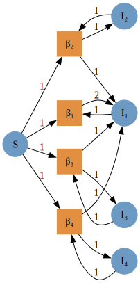
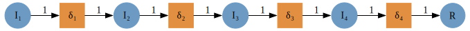
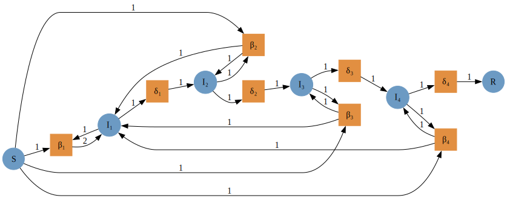
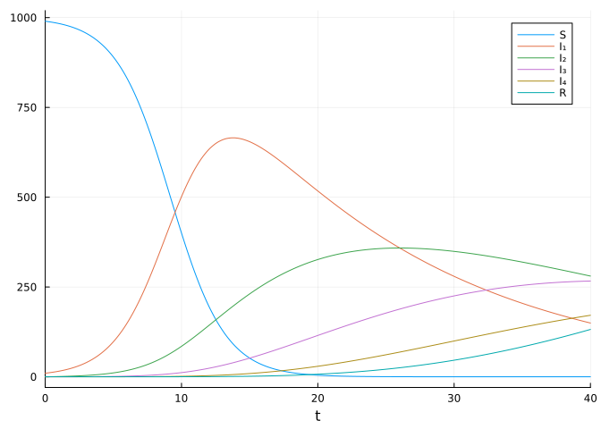
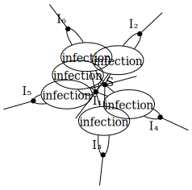
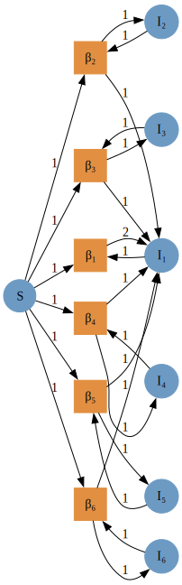
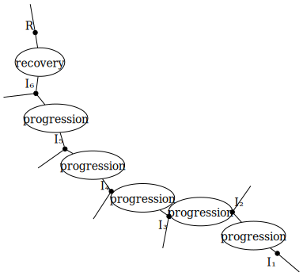
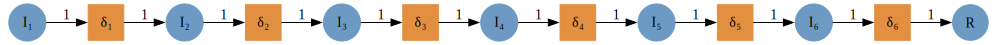
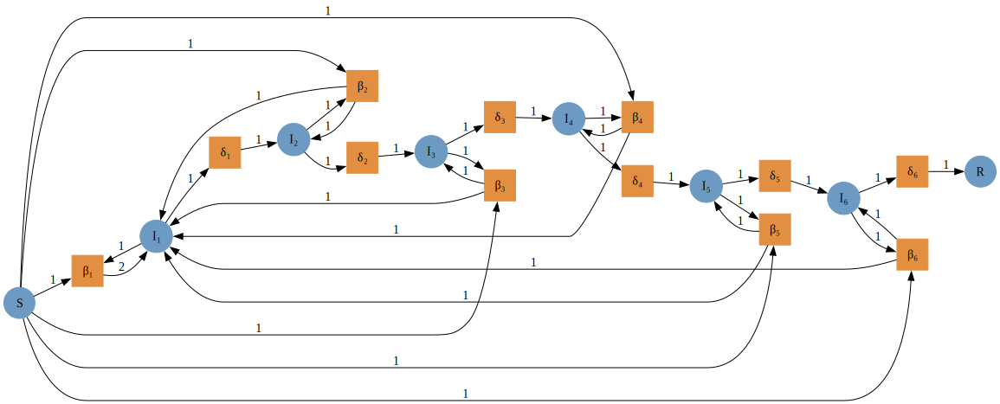
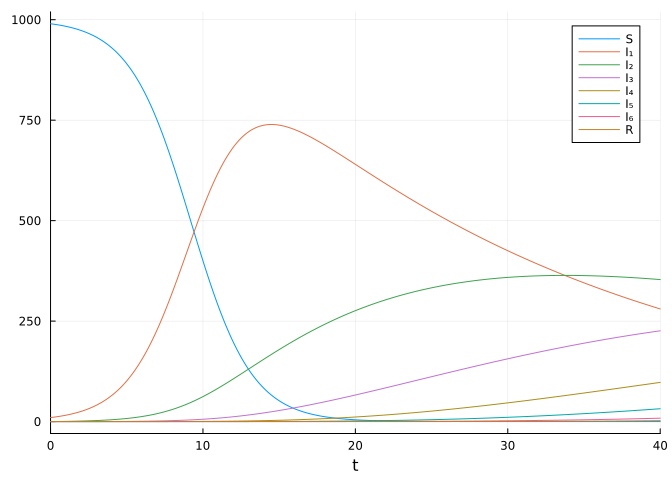

# Applying the linear chain trick using AlgebraicPetri.jl
Simon Frost (@sdwfrost) and Sean L. Wu (@slwu89)
2023-06-14

## Introduction

This example extends the [basic SIR
model](https://github.com/epirecipes/EpiCats/blob/main/pn_compose_sir/pn_compose_sir.ipynb)
using the linear chain trick (see [this
paper](https://link.springer.com/article/10.1007/s00285-019-01412-w) for
more background), in which we chain together multiple infected stages in
order to change the infectious period distribution.

## Libraries

``` julia
using AlgebraicPetri,AlgebraicPetri.TypedPetri
using Catlab, Catlab.CategoricalAlgebra, Catlab.Programs
using Catlab.WiringDiagrams, Catlab.Graphics
using AlgebraicDynamics.UWDDynam
using LabelledArrays
using OrdinaryDiffEq
using Plots
```

## Transitions

For convenience, we define `sub`, a function that generate subscripted
variables as strings.

``` julia
nstages = 4
sub(i::Int) = i<0 ? error("$i is negative") : join('₀'+d for d in reverse(digits(i)))
sub(x::String,i::Int) = x*sub(i);
```

We define a labelled Petri net that has the different types of
transition in our models. The first argument is an array of state names
as symbols (here, a generic `:Pop`), followed by the transitions in the
model. Transitions are given as
`transition_name=>((input_states)=>(output_states))`.

``` julia
epi_lpn = LabelledPetriNet(
  [:Pop],
  :infection=>((:Pop, :Pop)=>(:Pop, :Pop)),
  :progression=>(:Pop=>:Pop),
  :recovery=>(:Pop=>:Pop)
);
```

Next, we define the transmission model as an undirected wiring diagram
using the `@relation` macro, as in [the basic SIR
example](https://github.com/epirecipes/EpiCats/blob/main/pn_compose_sir/pn_compose_sir.ipynb).
The steps are as follows:

1.  Define the undirected wiring diagram.
2.  Convert to an `ACSetTransformation` by composing the wiring diagram
    with the labelled Petri net of transitions.
3.  Extract the composed Petri net from the `ACSetTransformation`.

We use four terms that capture the generation of `I₁` from the four
infectious stages, with a separate `β` parameter for each stage.

``` julia
si_uwd = @relation (S, I₁, I₂, I₃, I₄) where (S::Pop, I₁::Pop, I₂::Pop, I₃::Pop, I₄::Pop) begin
    infection(S,I₁,I₁,I₁)
    infection(S,I₂,I₁,I₂)
    infection(S,I₃,I₁,I₃)
    infection(S,I₄,I₁,I₄)
end
betas = Symbol.([sub("β",i) for i=1:nstages])
si_acst = oapply_typed(epi_lpn, si_uwd, betas)
si_lpn = dom(si_acst)
to_graphviz(si_lpn)
```



We repeat for the progression (`I₁` to `I₂`, etc.) and recovery (`I₄` to
`R`) transitions; we will use an indexed parameter `δ` for both the
progression and recovery rates.

``` julia
ir_uwd = @relation (I₁, I₂, I₃, I₄, R) where (I₁::Pop, I₂::Pop, I₃::Pop, I₄::Pop, R::Pop) begin
    progression(I₁,I₂)
    progression(I₂,I₃)
    progression(I₃,I₄)
    recovery(I₄,R)
end
deltas = Symbol.([sub("δ",i) for i=1:nstages])
ir_acst = oapply_typed(epi_lpn, ir_uwd, deltas)
ir_lpn = dom(ir_acst)
to_graphviz(ir_lpn)
```



To glue the SI and IR models together to make an SIR model, we perform
the following: 1. We define an undirected wiring diagram which contains
all our states, and two transitions. 2. We then create a
`StructuredMulticospan` using this wiring diagram and a dictionary that
maps the objects in the wiring diagram with the transmission and
recovery Petri nets generated previously. 3. We extract the composed
labelled Petri net.

``` julia
sir_uwd = @relation (S, I₁, I₂, I₃, I₄, R) where (S::Pop, I₁::Pop, I₂::Pop, I₃::Pop, I₄::Pop, R::Pop) begin
    si(S, I₁, I₂, I₃, I₄)
    ir(I₁, I₂, I₃, I₄, R)
end
sir_smc = oapply(sir_uwd, Dict(
    :si => Open(si_lpn),
    :ir => Open(ir_lpn),
))
sir_lpn = apex(sir_smc)
to_graphviz(sir_lpn)
```



## Running the model

To run an ODE model from the labelled Petri net, we define a vector
field, the initial conditions, the parameter array, and the time span.

``` julia
sir_vf = vectorfield(sir_lpn);
u0 = @LArray [990.0, 10.0, 0.0, 0.0, 0.0, 0.0] Tuple(snames(sir_lpn))
p = @LArray vec([repeat([0.5/1000],4); repeat([0.25/4],4)]) Tuple(tnames(sir_lpn))
tspan = (0.0, 40.0);
```

We can now solve the system.

``` julia
sir_prob = ODEProblem(sir_vf, u0, tspan, p)
sir_sol = solve(sir_prob, Rosenbrock32())
plot(sir_sol)
```



## Programmatic Generation of Composition Diagrams

While in many cases it is elegant and insightful to use the `@relation`
macro from Catlab to construct composition syntax (undirected wiring
diagrams, UWD), it can become tedious and error-prone for large
diagrams. In these cases, we may use the methods of operad algebras
already seen to construct complex UWDs themselves from simpler UWDs
using the `oapply` method to nest entire diagrams within boxes of other
diagrams. Another method however, is to interact with the imperative
interface for UWDs provided by Catlab, which constructs UWDs by directly
adding boxes, junctions, ports, and wires to an empty UWD.

We show here how to define functions that let one prepare UWDs for the
SIR model with Erlang stages of infection where the number of stages may
be an arbitrary number $n \geq 2$.

First we define a function that sets up the UWD describing the
composition syntax for infection transitions. In the function, we first
create an empty `RelationDiagram` with $n+1$ junctions of type `:Pop`,
mapping into our type Petri net $P_{type}$, for the susceptible and all
infectious populations. We then generate the dictionary `junctions`
which also assigns each junction a variable name (`variable`) and
assigns it to an outer port. The dictionary will map those names to the
integer ID of the junction in the UWD. Next we generate the boxes which
will represent the infection processes in a for loop. We first make a
vector of `Symbol`s giving the junctions that this box will connect to,
then add the box (all named `:infection`, to map to $P_{type}$), and
finally set the junctions to which ports on this box map to.

``` julia
nstages = 6

function si_stages_uwd(n)
    uwd = RelationDiagram(repeat([:Pop], n+1))
    junctions = Dict(begin
        variable = i <= n ? Symbol(sub("I",i)) : :S
        junction = add_junction!(uwd, :Pop, variable=variable)
        set_junction!(uwd, port, junction, outer=true)
        variable => junction
    end for (i, port) in enumerate(ports(uwd, outer=true)))
    for i in 1:n
        box_wires = [:S, Symbol(sub("I",i)),Symbol(sub("I",1)),Symbol(sub("I",i))]
        box = add_box!(uwd, [junction_type(uwd, junctions[p]) for p in box_wires], name=:infection)
        for (i, port) in enumerate(ports(uwd, box))
            set_junction!(uwd, port, junctions[box_wires[i]])
        end
    end
    return uwd
end

si_uwd = si_stages_uwd(nstages)
to_graphviz(si_uwd, box_labels=:name, junction_labels=:variable)
```



We then compose submodels according to the UWD to produce the typed
Petri net describing the transmission model.

``` julia
betas = Symbol.([sub("β",i) for i=1:nstages])
si_acst = oapply_typed(epi_lpn, si_uwd, betas)
si_lpn = dom(si_acst)
to_graphviz(si_lpn)
```



A similar function can be used to construct the UWD describing
progression between substages and eventual recovery.

``` julia
function ir_stages_uwd(n)
    uwd = RelationDiagram(repeat([:Pop], n+1))
    junctions = Dict(begin
        variable = i <= n ? Symbol(sub("I",i)) : :R
        junction = add_junction!(uwd, :Pop, variable=variable)
        set_junction!(uwd, port, junction, outer=true)
        variable => junction
    end for (i, port) in enumerate(ports(uwd, outer=true)))
    for i in 1:n
        box_wires = i < n ? [Symbol(sub("I",i)), Symbol(sub("I",i+1))] : [Symbol(sub("I",i)), :R] 
        box_name = i < n ? :progression : :recovery
        box = add_box!(uwd, [junction_type(uwd, junctions[p]) for p in box_wires], name=box_name)
        for (i, port) in enumerate(ports(uwd, box))
            set_junction!(uwd, port, junctions[box_wires[i]])
        end
    end
    return uwd
end

ir_uwd = ir_stages_uwd(nstages)
to_graphviz(ir_uwd, box_labels=:name, junction_labels=:variable)
```



As before, we compose concrete submodels to produce the typed Petri net.

``` julia
deltas = Symbol.([sub("δ",i) for i=1:nstages])
ir_acst = oapply_typed(epi_lpn, ir_uwd, deltas)
ir_lpn = dom(ir_acst)
to_graphviz(ir_lpn)
```



Finally we need a function to make the UWD that will combine the
infection and progression submodels.

``` julia
function sir_stages_uwd(n)
    uwd = RelationDiagram(repeat([:Pop], n+2))
    states = [[Symbol(sub("I",i)) for i in 1:n]; :S; :R]
    junctions = Dict(begin
        junction = add_junction!(uwd, :Pop, variable=state)
        set_junction!(uwd, port, junction, outer=true)
        state => junction
    end for (state, port) in zip(states, ports(uwd, outer=true)))
    # add si box
    box_wires = states[[n+1;1:n]]
    box = add_box!(uwd, [junction_type(uwd, junctions[p]) for p in box_wires], name=:si)
    for (i, port) in enumerate(ports(uwd, box))
        set_junction!(uwd, port, junctions[box_wires[i]])
    end
    # add ir box
    box_wires = states[[1:n;end]]
    box = add_box!(uwd, [junction_type(uwd, junctions[p]) for p in box_wires], name=:ir)
    for (i, port) in enumerate(ports(uwd, box))
        set_junction!(uwd, port, junctions[box_wires[i]])
    end
    return uwd
end

sir_uwd = sir_stages_uwd(nstages)
to_graphviz(sir_uwd, box_labels=:name, junction_labels=:variable)
```


Composition produces the full stage-structured model.

``` julia
sir_smc = oapply(sir_uwd, Dict(
    :si => Open(si_lpn),
    :ir => Open(ir_lpn),
))
sir_lpn = apex(sir_smc)
to_graphviz(sir_lpn)
```



We may then generate a vectorfield from the Petri net, using the law of
mass-action, and solve a trajectory.

``` julia
sir_vf = vectorfield(sir_lpn);
u0 = @LArray [990.0, 10.0, 0.0, 0.0, 0.0, 0.0, 0.0, 0.0] Tuple(snames(sir_lpn))
p = @LArray vec([repeat([0.5/1000],6); repeat([0.25/6],6)]) Tuple(tnames(sir_lpn))
tspan = (0.0, 40.0);

sir_prob = ODEProblem(sir_vf, u0, tspan, p)
sir_sol = solve(sir_prob, Rosenbrock32())
plot(sir_sol, labels=hcat(string.(snames(sir_lpn))...))
```


