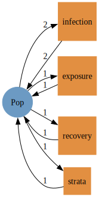
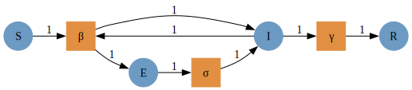
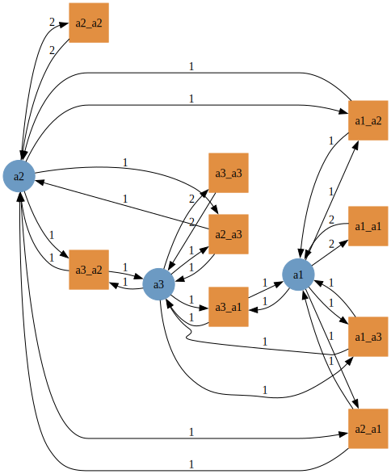
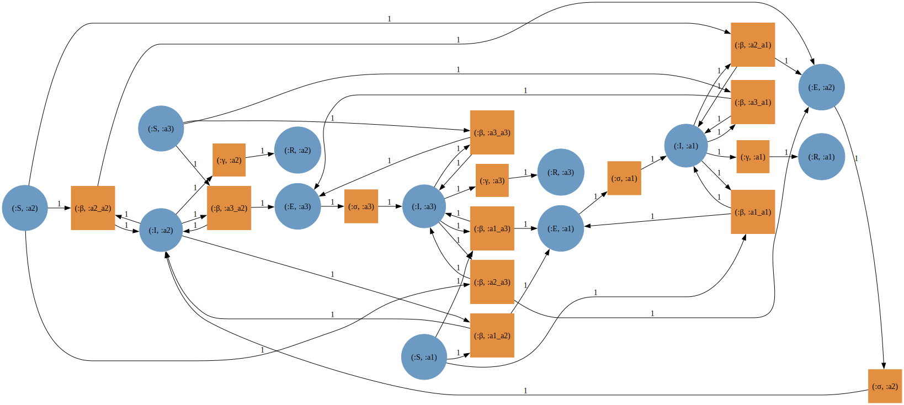
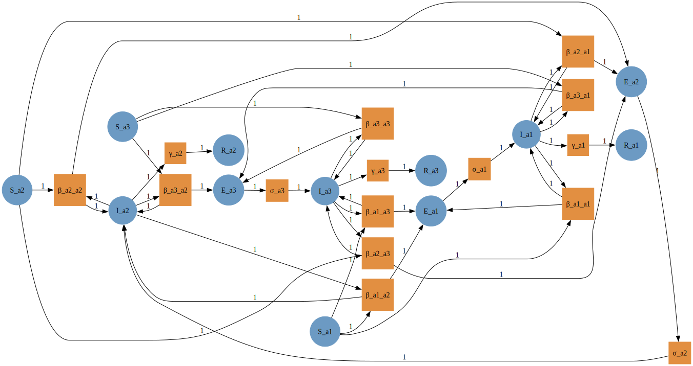
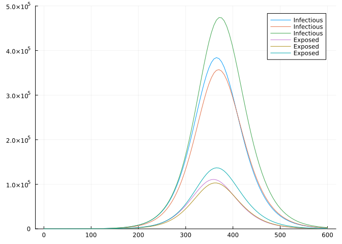
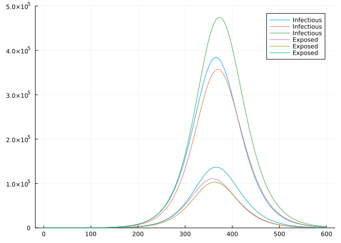

# Stratifying an SIR model by age group using AlgebraicPetri.jl
Simon Frost (@sdwfrost)
2024-07-22

## Introduction

This example serves as an extension to the ‘Hello World’ to stratifying
Petri net models; rather than specifying two risk groups manually, we
use Catlab’s imperative interface to specify and wire together groups.
The idea here is that we can specify a potentially large number of
groups (e.g. age classes) programmatically. For simplicity, we will
consider no movement between groups i.e. for age classes, no ageing over
the course of the epidemic simulation.

## Libraries

``` julia
using AlgebraicPetri,AlgebraicPetri.TypedPetri
using Catlab, Catlab.CategoricalAlgebra, Catlab.Programs
using Catlab.WiringDiagrams, Catlab.Graphics
using AlgebraicDynamics.UWDDynam
using OrdinaryDiffEq
using LinearAlgebra
using LabelledArrays
using Plots
```

## Transitions

We first define a labelled Petri net that has the different types of
transition in our models. The first argument is an array of state names
as symbols (here, a generic `:Pop`), followed by the transitions in the
model. Transitions are given as
`transition_name=>((input_states)=>(output_states))`. In this model, we
consider the groups as fixed (i.e. no changes between strata), so we
just need to have infection and recovery in the model.

``` julia
epi_transitions = LabelledPetriNet(
  [:Pop],
  :infection=>((:Pop, :Pop)=>(:Pop, :Pop)),
  :exposure=>(:Pop=>:Pop),
  :recovery=>(:Pop=>:Pop),
  :strata=>(:Pop=>:Pop)
)
to_graphviz(epi_transitions)
```



We create a labelled Petri net of the SEIR model using the above
transitions.

``` julia
seir_uwd = @relation () where (S::Pop, E::Pop, I::Pop, R::Pop) begin
    infection(S, I, E, I)
    exposure(E, I)
    recovery(I, R)
end
seir_acst = oapply_typed(epi_transitions, seir_uwd, [:β , :σ, :γ])
seir_lpn = dom(seir_acst) # Extract labelled Petri net
to_graphviz(seir_lpn)
```



## Age class model

``` julia
function make_age_classes(K, prefix="a")
    # Start with a blank UWD with K populations
    uwd = RelationDiagram(repeat([:Pop], K))
    # Build junctions (just a `Dict`), with the side effect of updating the UWD
    # `junctions` will be as follows similar to the following
    # Dict{Symbol, Int64} with n entries:
    #   :a1 => 1
    #   :a2 => 2
    junctions = Dict(begin
        variable = Symbol(prefix * "$(i)")
        junction = add_junction!(uwd, :Pop, variable=variable)
        set_junction!(uwd, port, junction, outer=true)
        variable => junction
    end for (i, port) in enumerate(ports(uwd, outer=true)))
    
    # This generates all combinations of the keys
    # Here, this will be a matrix of all pairs of keys
    pairs = collect(Iterators.product(keys(junctions), keys(junctions)))
    # This creates an empty vector to store the transition names in
    tnames = Vector{Symbol}(undef,0)
    ## Cycle through pairs and add boxes for infection
    for pair in pairs
        # We need 4 entries in the tuple as :infection is defined as infection(S, I, I, I)
        ins_outs = (pair[1], pair[2], pair[1], pair[2])
        # In the below, [junction_type(uwd, junctions[p]) for p in ins_outs] is just a vector of 4 :Pop
        box = add_box!(uwd, [junction_type(uwd, junctions[p]) for p in ins_outs], name=:infection)
        for (rgn, port) in zip(ins_outs, ports(uwd, box))
            set_junction!(uwd, port, junctions[rgn])
        end
        # This adds the names (as `Symbol`s) to the vector of transition names
        push!(tnames,Symbol("$(pair[1])_$(pair[2])"))
    end
    ## Generate an ACSet transformation using the above `epi_transitions`
    act = oapply_typed(epi_transitions, uwd, tnames)
    return act
end;
```

``` julia
K = 3
age_acst = make_age_classes(K)
age_lpn = dom(age_acst)
to_graphviz(age_lpn)
```



## Composing the models

The age model already has `:infection`, but not `:exposure` or
`:recovery`, so we add these in.

``` julia
seir_acst_augmented = add_reflexives(seir_acst, repeat([[:strata]], 4), epi_transitions)
age_acst_augmented = add_reflexives(age_acst, repeat([[:exposure, :recovery]], K), epi_transitions);
```

``` julia
age_acst_tnames = dom(age_acst)[:tname]
age_acst_snames = dom(age_acst)[:sname]
for s in age_acst_snames
    for k in 1:2
        push!(age_acst_tnames,s)
    end
end
dom(age_acst_augmented)[:tname] = age_acst_tnames;
```

We can now compose the models using `typed_product`.

``` julia
seir_age_acst = typed_product(seir_acst_augmented, age_acst_augmented)
seir_age_lpn = dom(seir_age_acst);
```

Note that for the transmission terms, the first index refers to the
susceptible group, and the second to the infected group.

``` julia
to_graphviz(seir_age_lpn)
```



We flatten the labels to allow the model to be lowered into an ODE.

``` julia
seir_age_lpn_flatlabels = flatten_labels(seir_age_lpn)
to_graphviz(seir_age_lpn_flatlabels)
```



## Running the model

To run the model, we need to choose specific group sizes and parameter
values. Note that the ordering of the states and parameters is not
lexographic.

``` julia
snames(seir_age_lpn_flatlabels)
```

    12-element Vector{Symbol}:
     :S_a2
     :I_a2
     :E_a2
     :R_a2
     :S_a3
     :I_a3
     :E_a3
     :R_a3
     :S_a1
     :I_a1
     :E_a1
     :R_a1

``` julia
tnames(seir_age_lpn_flatlabels)
```

    15-element Vector{Symbol}:
     :β_a2_a2
     :β_a3_a2
     :β_a1_a2
     :β_a2_a3
     :β_a3_a3
     :β_a1_a3
     :β_a2_a1
     :β_a3_a1
     :β_a1_a1
     :σ_a2
     :γ_a2
     :σ_a3
     :γ_a3
     :σ_a1
     :γ_a1

``` julia
seir_states = ["S", "E", "I", "R"]
age_states = ["a" * string(i) for i in 1:K]
pop_names = permutedims(hcat(repeat([seir_states], K)...)) .* "_" .* hcat(repeat([age_states], 4)...)
N = [14799290, 16526302, 28961159]
i₀ = 1e-6
inits = [1.0-i₀, 0.0, i₀, 0.0]
ukpop = hcat(repeat([N], 4)...)
u0_vector = vec(hcat(repeat([inits], K)...)' .* ukpop)
u0_names = vec(pop_names)
cm_orig = hcat([[7.883663, 2.794154, 1.565665],
           [3.120220, 4.854839, 2.624868],
           [3.063895, 4.599893, 5.005571]]...)'
cm_norm = cm_orig/maximum(eigvals(cm_orig))
cm = cm_norm ./ N
β = 1.3/7
σ = 1.0/2
γ = 1.0/7
β_matrix = hcat([[β*cm[i,j] for i in 1:K] for j in 1:K]...)
β_names = hcat([["β_" * age_states[i] * "_" * age_states[j] for i in 1:K] for j in 1:K]...)
σ_vector = repeat([σ], K)
σ_names = ["σ_" * a for a in age_states]   
γ_vector = repeat([γ], K)
γ_names = ["γ_" * a for a in age_states]
p_vector = [vec(β_matrix); σ_vector; γ_vector]
p_names = [vec(β_names); σ_names; γ_names]
```

    15-element Vector{String}:
     "β_a1_a1"
     "β_a2_a1"
     "β_a3_a1"
     "β_a1_a2"
     "β_a2_a2"
     "β_a3_a2"
     "β_a1_a3"
     "β_a2_a3"
     "β_a3_a3"
     "σ_a1"
     "σ_a2"
     "σ_a3"
     "γ_a1"
     "γ_a2"
     "γ_a3"

``` julia
u0 = @LArray u0_vector Tuple(Symbol.(u0_names))
p = @LArray p_vector Tuple(Symbol.(p_names))
tspan = (0.0, 600.0);
```

We then compute the vector field from the labelled Petri net (with
flatten labels), define the `ODEProblem`, and solve.

``` julia
seir_age_vf = vectorfield(seir_age_lpn_flatlabels)
seir_age_prob = ODEProblem(seir_age_vf, u0, tspan, p)
```

    ODEProblem with uType LArray{Float64, 1, Vector{Float64}, (:S_a1, :S_a2, :S_a3, :E_a1, :E_a2, :E_a3, :I_a1, :I_a2, :I_a3, :R_a1, :R_a2, :R_a3)} and tType Float64. In-place: true
    timespan: (0.0, 600.0)
    u0: 12-element LArray{Float64, 1, Vector{Float64}, (:S_a1, :S_a2, :S_a3, :E_a1, :E_a2, :E_a3, :I_a1, :I_a2, :I_a3, :R_a1, :R_a2, :R_a3)}:
     :S_a1 => 1.479927520071e7
     :S_a2 => 1.6526285473698e7
     :S_a3 => 2.8961130038840998e7
     :E_a1 => 0.0
     :E_a2 => 0.0
     :E_a3 => 0.0
     :I_a1 => 14.79929
     :I_a2 => 16.526301999999998
     :I_a3 => 28.961159
     :R_a1 => 0.0
     :R_a2 => 0.0
     :R_a3 => 0.0

``` julia
seir_age_sol = solve(seir_age_prob, Tsit5());
```

## Processing the output

``` julia
t = seir_age_sol.t
E_out = permutedims(hcat(seir_age_sol[[:E_a1, :E_a2, :E_a3]]...))
I_out = permutedims(hcat(seir_age_sol[[:I_a1, :I_a2, :I_a3]]...))
plot(t, I_out, label="Infectious", ylim=(0,500000))
plot!(t, E_out, label="Exposed")
```



## Comparison to Epidemics.jl

``` julia
using Epidemics
```

``` julia
population = Population("UK",
                         N,
                         permutedims(hcat(repeat([[1.0-i₀, 0.0, i₀, 0.0, 0.0]],K)...)),
                         cm_orig)
out = epidemic_default(β=[β],
                       σ=[σ],
                       γ=[γ],
                       population=population,
                       intervention=nothing,
                       vaccination=nothing,
                       time_end = 600.0,
                       increment = 1.0);
```

``` julia
epidemics_sol = out[1]
t = epidemics_sol.t
u = epidemics_sol.u[1:length(epidemics_sol)]
E_out = permutedims(hcat([x[4:6] for x in u]...))
I_out = permutedims(hcat([x[7:9] for x in u]...))
plot(t, I_out, label="Infectious", ylim=(0,500000))
plot!(t, E_out, label="Exposed")
```



## Comparison to Epiverse epidemics package

``` julia
using RCall
using DataFrames
using Query
using StatsPlots
```

``` julia
R"""
library(epidemics)
# load contact and population data from socialmixr::polymod
polymod <- socialmixr::polymod
contact_data <- socialmixr::contact_matrix(
  polymod,
  countries = "United Kingdom",
  age.limits = c(0, 20, 40),
  symmetric = TRUE
)

# prepare contact matrix
contact_matrix <- t(contact_data$matrix)

# prepare the demography vector
demography_vector <- contact_data$demography$population
names(demography_vector) <- rownames(contact_matrix)

# initial conditions: one in every 1 million is infected
initial_i <- 1e-6
initial_conditions <- c(
  S = 1 - initial_i, E = 0, I = initial_i, R = 0, V = 0
)

# build for all age groups
initial_conditions <- rbind(
  initial_conditions,
  initial_conditions,
  initial_conditions
)
rownames(initial_conditions) <- rownames(contact_matrix)

uk_population <- population(
  name = "UK",
  contact_matrix = contact_matrix,
  demography_vector = demography_vector,
  initial_conditions = initial_conditions
)

epidemics_sol <- model_default(
  population=uk_population,
  transmission_rate = 1.3/7,
  infectiousness_rate = 1/2,
  recovery_rate = 1/7,
  intervention = NULL,
  vaccination = NULL,
  time_dependence = NULL,
  time_end = 600,
  increment = 1.0
)
""";
```

    ┌ Warning: RCall.jl: Using POLYMOD social contact data. To cite this in a publication, use the 'cite' function
    │ Removing participants that have contacts without age information. To change this behaviour, set the 'missing.contact.age' option
    └ @ RCall ~/.julia/packages/RCall/gOwEW/src/io.jl:172

``` julia
@rget epidemics_sol;
```

``` julia
epidemics_sol |>
    @filter(_.compartment in ["exposed", "infectious"]) |>
    @df plot(:time,
             :value,
             group=(:demography_group, :compartment),
             ylim=(0,500000),
             xlabel="Time",
             ylabel="Number")
```


