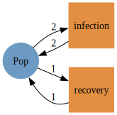
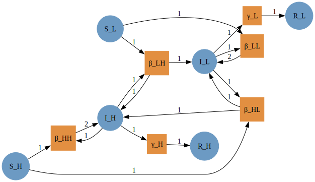
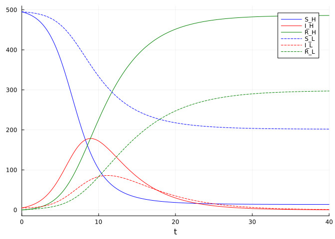
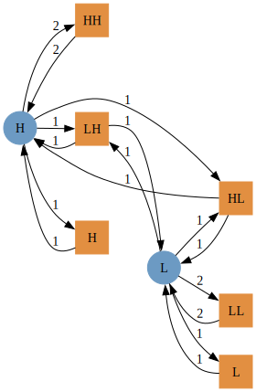
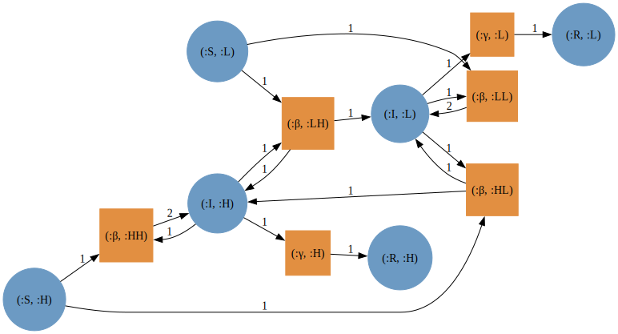

# Stratifying an SIR model by two risk groups using AlgebraicPetri.jl
Simon Frost (@sdwfrost)
2023-06-13

## Introduction

This example serves as a ‘Hello World’ to stratifying Petri net models,
where an SIR model is stratified by another model - in this case, two
risk groups, `H` and `L`, with high and low contact rates respectively.
The stratification is done using two manually specified models. At the
end, we use Catlab’s imperative interface to construct the risk group
model programmatically; while this is more useful for models with many
groups, it serves as a good test case.

## Libraries

``` julia
using AlgebraicPetri,AlgebraicPetri.TypedPetri
using Catlab, Catlab.CategoricalAlgebra, Catlab.Programs
using Catlab.WiringDiagrams, Catlab.Graphics
using AlgebraicDynamics.UWDDynam
using OrdinaryDiffEq
using LabelledArrays
using Plots
```

## Transitions

We first define a labelled Petri net that has the different types of
transition in our models. The first argument is an array of state names
as symbols (here, a generic `:Pop`), followed by the transitions in the
model. Transitions are given as
`transition_name=>((input_states)=>(output_states))`. In this model, we
consider the groups as fixed (i.e. no changes between strata), so we
just need to have infection and recovery in the model.

``` julia
epi_transitions = LabelledPetriNet(
  [:Pop],
  :infection=>((:Pop, :Pop)=>(:Pop, :Pop)),
  :recovery=>(:Pop=>:Pop)
)
to_graphviz(epi_transitions)
```



We create a labelled Petri net of the SIR model using the above
transitions (or alternatively, we could compose from infection and
recovery submodels).

``` julia
sir_uwd = @relation () where (S::Pop, I::Pop, R::Pop) begin
    infection(S, I, I, I)
    recovery(I, R)
end
sir_acst = oapply_typed(epi_transitions, sir_uwd, [:β , :γ])
sir_lpn = dom(sir_acst)
to_graphviz(sir_lpn)
```


We then define a second model with two groups with different contact
rates. This also has infection and recovery terms defined in terms of
within- and between-group interactions.

``` julia
risk_uwd = @relation () where (H::Pop, L::Pop) begin
    infection(H,H,H,H) # Within H infection
    infection(H,L,H,L) # Infection of S_H by I_L
    infection(L,H,L,H) # Infection of S_L by I_H
    infection(L,L,L,L) # Within L infection
end
risk_acst = oapply_typed(epi_transitions, risk_uwd, [:HH, :HL, :LH, :LL])
```

    ACSetTransformation((T = FinFunction([1, 1, 1, 1], 4, 2), S = FinFunction([1, 1], 2, 1), I = FinFunction([1, 2, 1, 2, 1, 2, 1, 2], 8, 3), O = FinFunction([1, 2, 1, 2, 1, 2, 1, 2], 8, 3), Name = LooseVarFunction{Symbol, Symbol}(FinDomFunction(Union{AttrVar, Symbol}[], FinSet(0), TypeSet(Union{AttrVar, Symbol})), SetFunction(#10, TypeSet(Symbol), TypeSet(Symbol)), FinSet(0))), LabelledPetriNet {T:4, S:2, I:8, O:8, Name:0}, LabelledPetriNet {T:2, S:1, I:3, O:3, Name:0})

We create a stratified model by using a typed product between the SIR
model and the risk model, to generate an `ACSetTransformation`, from
which we subsequently extract a labelled Petri net.

``` julia
## Add recovery within groups
new_tnames = [dom(risk_acst)[:tname]; dom(risk_acst)[:sname]]
risk_acst = add_reflexives(risk_acst, repeat([[:recovery]], 2), epi_transitions)
dom(risk_acst)[:tname] = new_tnames
risk_lpn = dom(risk_acst)
to_graphviz(risk_lpn)
```


``` julia
sir_risk_acst = typed_product(sir_acst, risk_acst)
sir_risk_lpn = dom(sir_risk_acst)
to_graphviz(sir_risk_lpn)
```


The state names of the resulting stratified model are tuples of symbols:

``` julia
snames(sir_risk_lpn)
```

    6-element Vector{Tuple{Symbol, Symbol}}:
     (:S, :H)
     (:I, :H)
     (:R, :H)
     (:S, :L)
     (:I, :L)
     (:R, :L)

The solvers in `OrdinaryDiffEq.jl` do not work with these state names,
so we use `flatten_labels` to obtain a vector of symbols (of the form
`:S_H`, `:I_H`, etc.).

``` julia
sir_risk_lpn_flatlabels = flatten_labels(sir_risk_lpn)
to_graphviz(sir_risk_lpn_flatlabels)
```



## Running the model

To run the model, we need to choose specific group sizes and parameter
values. We define two groups of equal size and initial composition.

``` julia
K = 2
S = [495.0, 495.0]
I = [5.0, 5.0]
R = [0.0, 0.0]
N = [S[i]+I[i]+R[i] for i in 1:K]
```

    2-element Vector{Float64}:
     500.0
     500.0

The model above is defined in terms of transmission rates between the
two groups, which is a combination of (a) the contact rates between the
two groups and (b) the probability of transmission per infectious
contact. We assume that the two groups have different overall contact
rates, `c`, and that the fraction of contacts between groups `i` and
`j`, `pij`, follows a proportional mixing assumption.

``` julia
β = 0.05
c = [20.0, 5.0]
pij = hcat([[c[j]*N[j]/sum([c[k]*N[k] for k in 1:K]) for j in 1:K] for i in 1:K]...)'
betas = (β .* (c .* pij) ./ N)
γ = 0.25;
```

We now define the initial conditions and parameter arrays as labelled
arrays.

``` julia
u0 = @LArray vec([S I R]')[:,1] Tuple(snames(sir_risk_lpn_flatlabels))
p = @LArray [vec(betas); γ; γ] Tuple(tnames(sir_risk_lpn_flatlabels))
tspan = (0.0, 40.0);
```

We then compute the vector field from the labelled Petri net (with
flatten labels), define the `ODEProblem`, and solve.

``` julia
sir_risk_vf = vectorfield(sir_risk_lpn_flatlabels)
sir_risk_prob = ODEProblem(sir_risk_vf, u0, tspan, p)
sir_risk_sol = solve(sir_risk_prob, Rosenbrock32());
```

## Plotting

``` julia
plot(sir_risk_sol, linecolor=[:blue :red :green], linestyle=[:solid :solid :solid :dash :dash :dash])
```



## Automating the generation of risk groups

We can also build the risk model using Catlab’s imperative interface.

``` julia
function make_risk_groups()
    # Start with a blank UWD with 2 populations
    uwd = RelationDiagram(repeat([:Pop], 2))
    # Specify the names of the groups
    names = ["H", "L"]
    # Build junctions (just a `Dict`), with the side effect of updating the UWD
    # `junctions` will be as follows
    # Dict{Symbol, Int64} with 2 entries:
    #   :H => 1
    #   :L => 2
    junctions = Dict(begin
        variable = Symbol(names[i])
        junction = add_junction!(uwd, :Pop, variable=variable)
        set_junction!(uwd, port, junction, outer=true)
        variable => junction
    end for (i, port) in enumerate(ports(uwd, outer=true)))
    
    # This generates all combinations of the keys
    # Here, this will be:
    # 2×2 Matrix{Tuple{Symbol, Symbol}}:
    #  (:H, :H)  (:H, :L)
    #  (:L, :H)  (:L, :L)
    pairs = collect(Iterators.product(keys(junctions), keys(junctions)))
    # This creates an empty vector to store the transition names in
    tnames = Vector{Symbol}(undef,0)
    ## Cycle through pairs and add boxes for infection
    for pair in pairs
        # We need 4 entries in the tuple as :infection is defined as infection(S, I, I, I)
        # So for the first pair, ins_outs = (:H, :H, :H, :H)
        ins_outs = (pair[1], pair[2], pair[1], pair[2])
        # In the below, [junction_type(uwd, junctions[p]) for p in ins_outs] is just a vector of 4 :Pop
        box = add_box!(uwd, [junction_type(uwd, junctions[p]) for p in ins_outs], name=:infection)
        # The below loops through zip((:H, :H, :H, :H), [1, 2, 3, 4])
        for (rgn, port) in zip(ins_outs, ports(uwd, box))
            set_junction!(uwd, port, junctions[rgn])
        end
        # This adds the names (as `Symbol`s) to the vector of transition names
        push!(tnames,Symbol("$(pair[1])$(pair[2])"))
    end
    ## Generate an ACSet transformation using the above `epi_transitions`
    act = oapply_typed(epi_transitions, uwd, tnames)
    return act
end;
```

We can now generate a `LabelledPetriNet` as follows.

``` julia
risk_automated_acst = make_risk_groups()
risk_automated_acst_tnames = dom(risk_automated_acst)[:tname]
risk_automated_acst_snames = dom(risk_automated_acst)[:sname]
## Add recovery within groups
risk_automated_acst = add_reflexives(risk_automated_acst, repeat([[:recovery]], 2), epi_transitions)
for s in risk_automated_acst_snames
    push!(risk_automated_acst_tnames,s)
end
```

``` julia
dom(risk_automated_acst)[:tname] = risk_automated_acst_tnames
risk_automated_lpn = dom(risk_automated_acst)
to_graphviz(risk_automated_lpn)
```



We stratify the SIR model by the risk model using `typed_product`, as
before.

``` julia
sir_risk_automated_acst = typed_product(sir_acst, risk_automated_acst)
sir_risk_automated_lpn = dom(sir_risk_automated_acst)
to_graphviz(sir_risk_automated_lpn)
```


